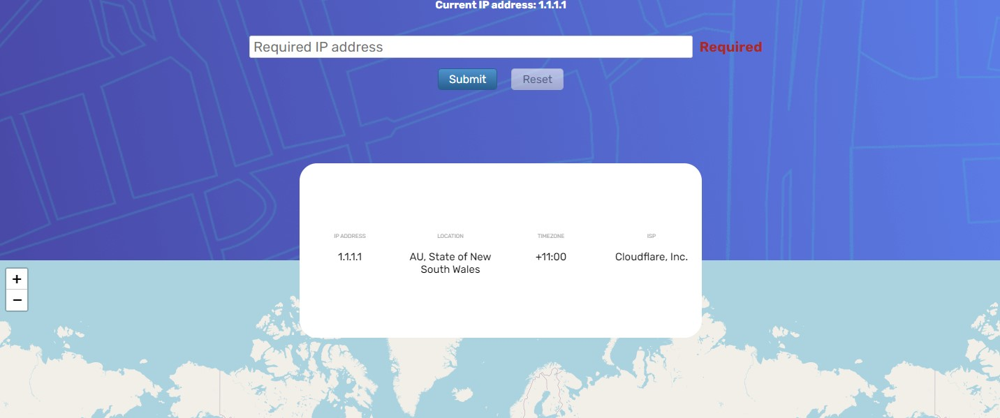
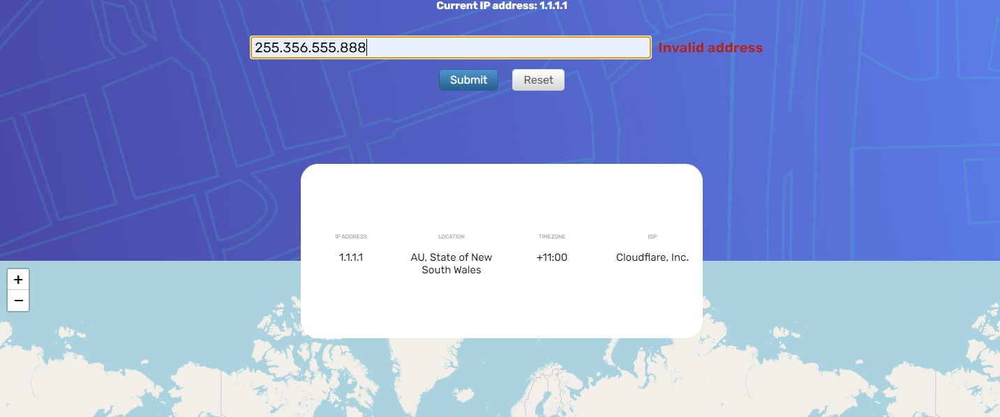
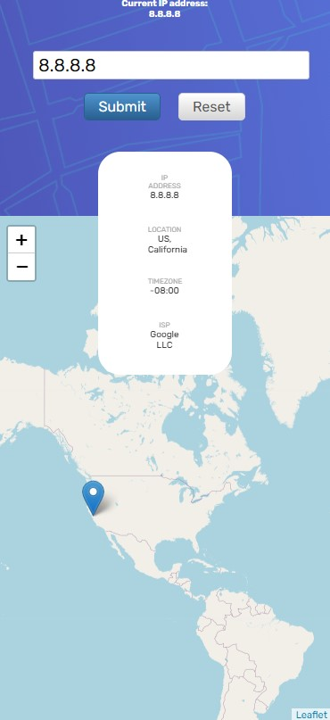

# IP ADDRESS TRACKER(ipify API)

Приложение предоставления данных по ip адресу.
Онлайн версия приложения: [Live version](https://ip-tracker-ver2-git-master.saint-fons.vercel.app/)
В некоторых случаях запрос к geo.ipify.org может быть заблокирован блокировщиком рекламы. Необходимо добавить в исключения или открыть в инкогнито.

## Приложение имеет функционал;

* Автоматическое определение адреса с которого идет запрос
* Информация о заданном ip адресе(по умолчанию по адресу с которого идет запрос)
* Маркер координат на карте
* Предоставление информации по заданному ip адресу

### npm init - для установки модулей
### npm start - для запуска приложения
### npm build - для продакшен  версии приложения(использован в Live version)

# Принцип работы;
#### 1) getAddress инициирует get запрос к ipify.org без указания ip(сервис определит адрес клиента)
#### 2) ipify.org вернет json с датой по адресу клиента
#### 3) форма ввода имеет валидацию и примет только адрес в формате 1.1.1.1-255.255.255.255
#### 4) после выполнения условий валидации, функция getAddress вызывается с адресом введенным в форме
#### 5) ipify.org возвращает json, который содержит информацию о ip адресе из формы
#### 6) значение широты и долготы предоставляются карте и отображается маркер

# Примеры адресов для ввода в форму;
#### Публичные Google DNS: 8.8.8.8 или 8.8.4.4
#### Публичные Cloudflare DNS: 1.1.1.1 или 1.0.0.1
#### Публичные Yandex DNS: 77.88.8.8 или 77.88.8.1. Подойдет и любой другой публичный ip

## Валидация формы

## Валидация формы(проверка на ошибки, диапазон ip адреса больше 255.255.255.255)

## Адаптивная верстка(пример для iPhone X)

